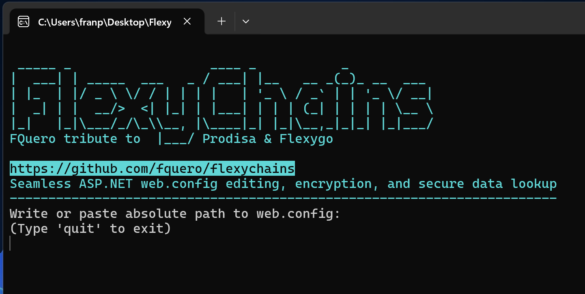
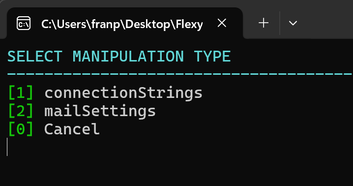
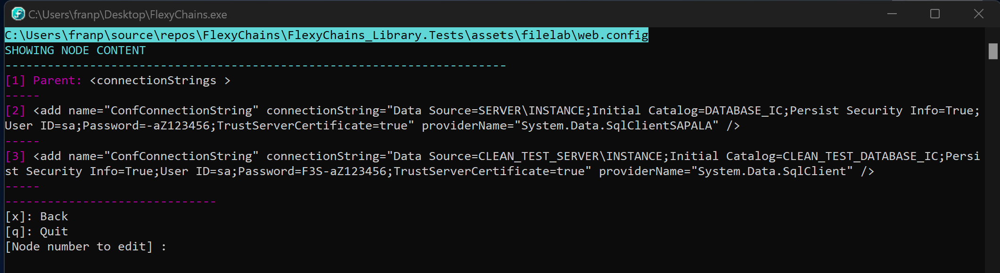

# FlexyChains

🚀 **What is FlexyChains?**  
FlexyChains is a powerful and easy-to-use tool for managing and editing encrypted configurations in .NET Framework applications, especially in `web.config` files. It allows developers and system administrators to **decrypt, modify, and re-encrypt** sensitive sections (such as connection strings and SMTP credentials) in a simple way, reducing errors and saving time.

### 🎯 **Project Purpose**
I developed this tool to **facilitate my work at [Prodisa](https://eprodisa.com) with [Flexygo](https://flexygo.com)**, and I am generously sharing it with the community to contribute and help .NET Framework developers in their daily tasks. FlexyChains aims to **automate** repetitive and error-prone tasks in configuration management for development and production environments.

---

## ⚙️ **Project Components**
FlexyChains consists of the following modules:

1. **FlexyChains_Library** (Class Library):
   - Handles the business logic for decrypting, modifying, and re-encrypting `web.config` sections.
   - Supports `RsaProtectedConfigurationProvider` and `DPAPIProtectedConfigurationProvider`.
   - Allows integration with external applications.

2. **FlexyChain_Console** (Console Application):
   - Command-line interface.
   - Facilitates automation through scripts in CI/CD environments.

3. **FlexyChain_GUI** (Graphical Interface - WPF):
   - **Not yet implemented**, but may be added in the future.
   - Its purpose would be to provide a user-friendly visual experience for configuration management.

---

## 🆕 **Improvements and Updates in v1.1.1**
✅ **New custom icon** for a more professional look.  
✅ **Standalone executable (.exe)** – no installation required.  
✅ **Easy management of encrypted sections** in `web.config`.  
✅ **Compatible with RSA and DPAPI encryption providers**.  
✅ **Available in console version**.  
✅ **Ready for extension** with two main interfaces: `INodeManipulator` and `IProtectionProvider`.

> **📌 Note:** The GUI (WPF) version **is not currently planned**, but may be added in future versions if there is demand.

---

## 🖥️ **Screenshots**

  
  
  
  

---

## 📂 **How to Use**
1️⃣ **Download** the `.exe` from the attached files.  
2️⃣ **Run the application as administrator** (if needed for decryption operations).  
3️⃣ **Select your `web.config` file**.  
4️⃣ **Decrypt, edit, and re-encrypt** sections easily.

---

## 📢 **Notes**
- This tool is designed for **.NET Framework 4.6.x or later** (not for .NET Core or .NET 5+).
- Make sure you have the **necessary encryption keys** before attempting decryption.
- **Users must run the application with appropriate permissions** to modify `web.config`.
- **FlexyChains is open-source** and licensed under **MIT**, meaning you can use, modify, and contribute freely.

---

## 📌 **Future Roadmap**
- Possible implementation of **WPF graphical interface**.
- Support for more encryption types and advanced validations.
- Optimization of `web.config` file handling across multiple environments.

---

## 🔽 **Download the Latest Version Below!**
If you encounter any issues or have suggestions, feel free to **open an issue on GitHub**. 🚀

# FlexyChains

ESPAÑOL

🚀 **¿Qué es FlexyChains?**  
FlexyChains es una herramienta potente y fácil de usar para gestionar y editar configuraciones cifradas en aplicaciones .NET Framework, especialmente en archivos `web.config`. Permite a desarrolladores y administradores de sistemas **desencriptar, modificar y volver a encriptar** secciones sensibles (como cadenas de conexión y credenciales SMTP) de manera sencilla, reduciendo errores y ahorrando tiempo.

### 🎯 **Propósito del Proyecto**
Esta herramienta la he desarrollado para **facilitar mi trabajo en [Prodisa](https://eprodisa.com) con [Flexygo](https://flexygo.com)**. La comparto para contribuir con la comunidad y ayudar a los desarrolladores de .NET Framework en su día a día. FlexyChains busca **automatizar** tareas repetitivas y propensas a errores en la gestión de configuraciones en entornos de desarrollo y producción.

---

## ⚙️ **Componentes del Proyecto**
FlexyChains está compuesto por los siguientes proyectos:

1. **FlexyChains_Library** (Librería de Clases):
   - Maneja la lógica de negocio para desencriptar, modificar y volver a encriptar secciones de `web.config`.
   - Soporta `RsaProtectedConfigurationProvider` y `DPAPIProtectedConfigurationProvider`.
   - Permite la integración con aplicaciones externas.

2. **FlexyChain** (Aplicación de Consola):
   - Interfaz basada en línea de comandos.
   
3. **FlexyChain_GUI** (Interfaz gráfica - WPF):
   - **Actualmente no está implementado**, pero podría añadirse en el futuro.
   - Su propósito sería permitir una experiencia visual amigable para la gestión de configuraciones.

4. **FlexyChain__Library.Tests** (xUnit Tests):

---

## 🆕 **Mejoras y novedades en v1.1.1**
✅ **Nuevo icono personalizado** para un aspecto más profesional.  
✅ **Ejecutable independiente (.exe)** – no requiere instalación.  
✅ **Gestión sencilla de secciones encriptadas** en `web.config`.  
✅ **Compatible con el proveedor de cifrado RSA**.  
✅ **Disponible en versión de consola**.  
✅ **Listo para ser extendido** con dos interfaces principales: `INodeManipulator` y `IProtectionProvider`.

> **📌 Nota:** Actualmente, la versión GUI (WPF) **no está prevista**, pero podría agregarse en futuras versiones si hay demanda.

---

## 🖥️ **Capturas de Pantalla**

  
  
  
  

---

## 📂 **Cómo Usar**
1️⃣ **Descarga** el `.exe` desde los archivos adjuntos.  
2️⃣ **Ejecuta la aplicación como administrador** (si es necesario para operaciones de desencriptado).  
3️⃣ **Selecciona tu archivo `web.config`**.  
4️⃣ **Desencripta, edita y vuelve a encriptar** secciones fácilmente.

---

## 📢 **Notas**
- Esta herramienta está diseñada para **aplicaciones en .NET Framework 4.6.x o superior** (no para .NET Core ni .NET 5+).
- Asegúrate de tener las **claves de cifrado necesarias** antes de intentar desencriptar.
- **El usuario debe ejecutar la aplicación con permisos adecuados** para realizar modificaciones en `web.config`.
- **FlexyChains es de código abierto** y está bajo licencia **MIT**, lo que significa que puedes usarlo, modificarlo y contribuir libremente.

---

## 📌 **Roadmap Futuro**
- Posible implementación de la **interfaz gráfica WPF**.
- Soporte para más tipos de cifrado y validaciones avanzadas.
- Optimización del manejo de archivos `web.config` en múltiples entornos.
